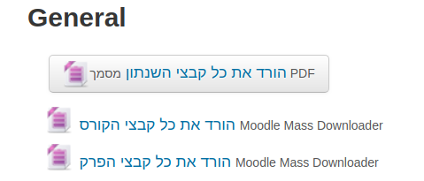

# Smart Moodle Downlaoder

Google Chrome extension. A simple yet smart extension to help you download content of Moodle courses.

## Features
- Download the content of all courses in Moodle you are signed for.
- Download entire Moodle course page.
- Download a specific section in a Moodle course page.
- Download a single course's video if it is now playing in StreamItUp

## Goals:
- Download all the videos automatically from the Course's Moodle page with a click of a button.
- Integrate Google Drive to easily upload the content and share it with ease.
- Have an option for UI in English
 
## Getting Started
- Clone the project using: ```git clone https://github.com/BenAsaf/smart-moodle-downloader.git```
(alternatively download and extract zip folder using https://github.com/BenAsaf/smart-moodle-downloader/archive/main.zip)
- Go into `chrome://extentions` (alternatively click the 3 dots in Chrome, More Tools and Extensions) and turn Developer Mode on.
- Click `Load unpacked extention...` and select the project folder  


## Use
Once you've installed the extension you should see this button on every section
<br>
Clicking it will download all of the section it's in into a nice folder


## Contributing
This extension was written and tested for Hebrew University's 2019 Moodle (https://moodle2.cs.huji.ac.il). We try to
support other versions of Moodle as well so if you happen to use a version that doesn't seem to be supported or have any bugs/features to report please open an issue.
 
## Authors
* **Ben Asaf** tobenasaf@gmail.com (Continuing the project)
* **Elad Shoham** eladshoham93@gmail.com (inactive)
* **Shimon Berkovich** (inactive)
* **David Pitts** (inactive)

Continuing the work of:

* **Tomer Keren** - [email](tomer.keren.dev@gmail.com), [github](https://www.github.com/Tadaboody)
See also the list of [contributors](https://github.com/Tadaboody/Moodle-Mass-Downloader/contributors) who participated in this project.

